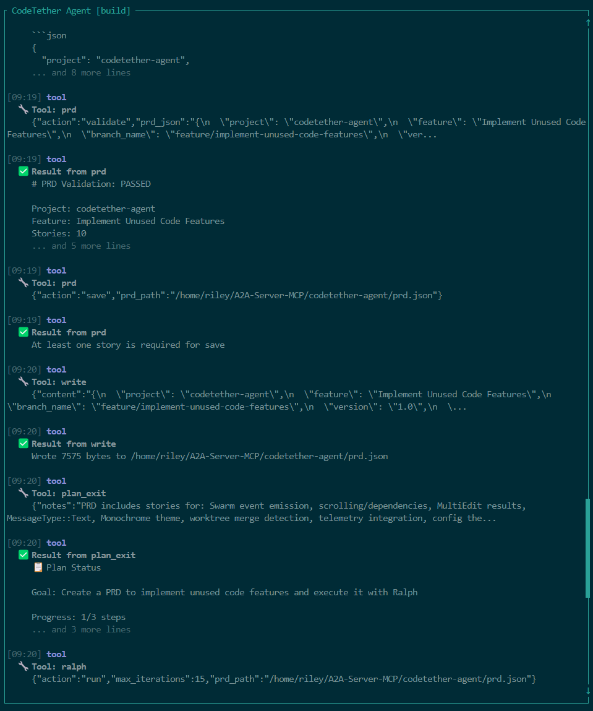

# CodeTether Agent

[](https://crates.io/crates/codetether-agent)
[](https://opensource.org/licenses/MIT)
[](https://github.com/rileyseaburg/codetether-agent/releases)

A high-performance AI coding agent with first-class A2A (Agent-to-Agent) protocol support, written in Rust. Features a rich terminal UI with dedicated views for swarm orchestration and autonomous PRD-driven development. Part of the CodeTether ecosystem.



## What's New in v0.1.5

- **Ralph TUI View** — Dedicated real-time view for autonomous PRD loops (`/ralph`). Per-story progress, quality gates, tool calls, and sub-agent messages with magenta theme.
- **Swarm Detail View** — Full per-agent detail in swarm mode. Arrow keys to navigate subtasks, Enter for tool call history and messages per sub-agent.
- **Interactive Model Selector** — `/model` command and `Ctrl+M` to browse and pick LLM models at runtime.
- **Webview Chat Layout** — Dashboard-style TUI with sidebar, inspector pane, and multi-panel chat (`/webview`, `Ctrl+B`).
- **A2A Worker Enhancements** — Heartbeat loop, robust error recovery, improved registration flow.
- **Copilot Provider** — GitHub Copilot integration with known-models fallback for the full model catalog.

See [full release notes](https://github.com/rileyseaburg/codetether-agent/releases/tag/v0.1.5).

## Features

- **A2A-Native**: Built from the ground up for the A2A protocol - works as a worker agent for the CodeTether platform
- **AI-Powered Coding**: Intelligent code assistance using multiple AI providers (OpenAI, Anthropic, Google, Moonshot, GitHub Copilot, etc.)
- **Swarm Execution**: Parallel sub-agent execution with real-time per-agent event streaming and dedicated TUI detail view
- **Ralph Loop**: Autonomous PRD-driven development with dedicated TUI view — give it a spec, watch it work story by story
- **Interactive TUI**: Rich terminal interface with webview layout, model selector, session picker, swarm view, and Ralph view
- **RLM Processing**: Handle context larger than model windows via recursive language model approach
- **Secure Secrets**: All API keys loaded exclusively from HashiCorp Vault - no environment variable secrets
- **27+ Tools**: Comprehensive tool system for file ops, LSP, code search, web fetch, and more
- **Session Management**: Persistent session history with git-aware storage
- **High Performance**: Written in Rust — 13ms startup, <20MB idle memory, true parallelism via tokio

## Installation

### From crates.io (Recommended)

```bash
cargo install codetether-agent
```

This installs the `codetether` binary to `~/.cargo/bin/`.

### From GitHub Releases

Download pre-built binaries from [GitHub Releases](https://github.com/rileyseaburg/codetether-agent/releases).

### From Source

```bash
git clone https://github.com/rileyseaburg/codetether-agent
cd codetether-agent
cargo build --release
# Binary at target/release/codetether
```

## Quick Start

### 1. Configure HashiCorp Vault

All API keys are stored in HashiCorp Vault for security. Set up your Vault connection:

```bash
export VAULT_ADDR="https://vault.example.com:8200"
export VAULT_TOKEN="hvs.your-token"
```

Store your provider API keys in Vault:

```bash
# Moonshot AI (default provider)
vault kv put secret/codetether/providers/moonshotai api_key="sk-..."

# OpenRouter (access to many models)
vault kv put secret/codetether/providers/openrouter api_key="sk-or-v1-..."

# Google AI
vault kv put secret/codetether/providers/google api_key="AIza..."

# Anthropic (or via Azure)
vault kv put secret/codetether/providers/anthropic api_key="sk-ant-..." base_url="https://api.anthropic.com"

# Azure Anthropic
vault kv put secret/codetether/providers/anthropic api_key="..." base_url="https://your-endpoint.azure.com/anthropic/v1"

# StepFun
vault kv put secret/codetether/providers/stepfun api_key="..."

vault kv put secret/codetether/providers/zhipuai api_key="..." base_url="https://api.z.ai/api/paas/v4"
```

### Supported Providers

| Provider | Default Model | Notes |
|----------|---------------|-------|
| `moonshotai` | `kimi-k2.5` | **Default** - excellent for coding |
| `github-copilot` | `claude-opus-4` | GitHub Copilot models (Claude, GPT, Gemini) |
| `openrouter` | `stepfun/step-3.5-flash:free` | Access to many models |
| `google` | `gemini-2.5-pro` | Google AI |
| `anthropic` | `claude-sonnet-4-20250514` | Direct or via Azure |
| `stepfun` | `step-3.5-flash` | Chinese reasoning model |

### 2. Connect to CodeTether Platform

```bash
# Connect as a worker to the CodeTether A2A server
codetether worker --server https://api.codetether.run --codebases /path/to/project

# Or with authentication
codetether worker --server https://api.codetether.run --codebases /path/to/project --token your-worker-token

# Or use the one-command deploy script (from repo root)
./deploy-worker.sh --codebases /path/to/project
```

### 3. Or Use Interactive Mode

```bash
# Start the TUI in current directory
codetether tui

# Start in a specific project
codetether tui /path/to/project
```

## CLI Quick Reference

```bash
# Interactive TUI (like opencode)
codetether tui

# Chat mode (no tools)
codetether run "explain this code"

# Swarm mode - parallel sub-agents for complex tasks
codetether swarm "implement feature X with tests"

# Ralph - autonomous PRD-driven development
codetether ralph run --prd prd.json

# Generate a PRD template
codetether ralph create-prd --feature "My Feature" --project-name "my-app"

# Start HTTP server
codetether serve --port 4096

# Show config
codetether config --show
```

## Usage

### Default Mode: A2A Worker

By default, `codetether` runs as an A2A worker that connects to the CodeTether platform:

```bash
# Connect to CodeTether platform
codetether --server https://api.codetether.run

# With custom worker name
codetether --server https://api.codetether.run --name "my-dev-machine"
```

Environment variables:
- `CODETETHER_SERVER` - A2A server URL
- `CODETETHER_TOKEN` - Authentication token
- `CODETETHER_WORKER_NAME` - Worker name

### Interactive TUI

```bash
codetether tui
```


The TUI provides:
- **Webview layout**: Dashboard with sidebar, chat, and inspector (`/webview` or `Ctrl+B`)
- **Model selector**: Browse and pick models at runtime (`/model` or `Ctrl+M`)
- **Swarm view**: `/swarm <task>` with real-time per-agent progress, tool calls, and detail view (`Enter` on a subtask)
- **Ralph view**: `/ralph [prd.json]` with per-story progress, quality gates, and sub-agent activity
- **Session management**: `/sessions` picker, `/resume`, `/new`
- **Real-time tool streaming**: See tool calls as they execute
- **Theme support**: Customizable colors via config with hot-reload

### TUI Slash Commands

| Command | Description |
|---------|-------------|
| `/swarm <task>` | Run task in parallel swarm mode |
| `/ralph [path]` | Start autonomous PRD loop (default: `prd.json`) |
| `/model [name]` | Open model picker or set model directly |
| `/sessions` | Open session picker to resume a previous session |
| `/resume [id]` | Resume most recent or specific session |
| `/new` | Start a fresh session |
| `/webview` | Switch to dashboard layout |
| `/classic` | Switch to single-pane layout |
| `/inspector` | Toggle inspector pane |
| `/refresh` | Refresh workspace and session cache |
| `/view` | Toggle swarm view |

### TUI Keyboard Shortcuts

| Key | Action |
|-----|--------|
| `Ctrl+M` | Open model selector |
| `Ctrl+B` | Toggle webview/classic layout |
| `Ctrl+S` / `F2` | Toggle swarm view |
| `F3` | Toggle inspector pane |
| `Tab` | Switch between build/plan agents |
| `Alt+j/k` | Scroll down/up |
| `Alt+u/d` | Half-page scroll |
| `Ctrl+R` | Search command history |
| `?` | Toggle help overlay |

### Non-Interactive Mode (Chat - No Tools)

```bash
# Run a single prompt (chat only, no file editing tools)
codetether run "explain how this codebase works"

# Continue from last session
codetether run --continue "add tests for the new feature"

# Use a specific model
codetether run --model openrouter/stepfun/step-3.5-flash:free "explain this code"
```

**Note:** `codetether run` is chat-only mode without tools. For coding tasks, use `swarm` or `ralph`.

### HTTP Server

```bash
# Start the API server
codetether serve --port 4096
```

### Configuration Management

```bash
# Show current config
codetether config --show

# Initialize default config
codetether config --init
```

## Configuration

Configuration is stored in `~/.config/codetether-agent/config.toml`:

```toml
[default]
provider = "anthropic"
model = "claude-sonnet-4-20250514"

[a2a]
enabled = true
auto_connect = true

[ui]
theme = "dark"

[session]
auto_save = true
```

**Note:** API keys are NOT stored in config files. They must be stored in HashiCorp Vault.

## HashiCorp Vault Setup

### Vault Secret Structure

```
secret/codetether/providers/
├── openai       → { "api_key": "sk-...", "organization": "org-..." }
├── anthropic    → { "api_key": "sk-ant-..." }
├── google       → { "api_key": "AIza..." }
├── deepseek     → { "api_key": "..." }
└── ...
```

### Environment Variables

| Variable | Description |
|----------|-------------|
| `VAULT_ADDR` | Vault server address (e.g., `https://vault.example.com:8200`) |
| `VAULT_TOKEN` | Vault authentication token |
| `VAULT_MOUNT` | KV secrets engine mount path (default: `secret`) |
| `VAULT_SECRETS_PATH` | Path prefix for provider secrets (default: `codetether/providers`) |
| `CODETETHER_DEFAULT_MODEL` | Default model to use (e.g., `moonshotai/kimi-k2.5`) |
| `CODETETHER_SERVER` | A2A server URL |
| `CODETETHER_TOKEN` | Authentication token |
| `CODETETHER_WORKER_NAME` | Worker name |

### Using Vault Agent

For production, use Vault Agent for automatic token renewal:

```hcl
# vault-agent.hcl
vault {
  address = "https://vault.example.com:8200"
}

auto_auth {
  method "kubernetes" {
    mount_path = "auth/kubernetes"
    config = {
      role = "codetether-agent"
    }
  }

  sink "file" {
    config = {
      path = "/tmp/vault-token"
    }
  }
}
```

## Agents

### Build Agent

Full access to development tools. Can read, write, edit files and execute commands.

### Plan Agent

Read-only access for analysis and exploration. Perfect for understanding codebases before making changes.

### Explore Agent

Specialized for code navigation and discovery.

## Tools

CodeTether Agent includes 27+ tools for comprehensive development automation:

### File Operations
| Tool | Description |
|------|-------------|
| `read_file` | Read file contents |
| `write_file` | Write content to files |
| `list_dir` | List directory contents |
| `glob` | Find files by pattern |
| `edit` | Apply search/replace patches |
| `multiedit` | Batch edits across multiple files |
| `apply_patch` | Apply unified diff patches |

### Code Intelligence
| Tool | Description |
|------|-------------|
| `lsp` | Language Server Protocol operations (definition, references, hover, completion) |
| `grep` | Search file contents with regex |
| `codesearch` | Semantic code search |

### Execution
| Tool | Description |
|------|-------------|
| `bash` | Execute shell commands |
| `batch` | Run multiple tool calls in parallel |
| `task` | Background task execution |

### Web & External
| Tool | Description |
|------|-------------|
| `webfetch` | Fetch web pages with smart extraction |
| `websearch` | Search the web for information |

### Agent Orchestration
| Tool | Description |
|------|-------------|
| `ralph` | Autonomous PRD-driven agent loop |
| `rlm` | Recursive Language Model for large contexts |
| `prd` | Generate and manage PRD documents |
| `plan_enter`/`plan_exit` | Switch to planning mode |
| `question` | Ask clarifying questions |
| `skill` | Execute learned skills |
| `todo_read`/`todo_write` | Track task progress |

## A2A Protocol

CodeTether Agent is built for the A2A (Agent-to-Agent) protocol:

- **Worker Mode** (default): Connect to the CodeTether platform and process tasks
- **Server Mode**: Accept tasks from other agents (`codetether serve`)
- **Client Mode**: Dispatch tasks to other A2A agents

### AgentCard

When running as a server, the agent exposes its capabilities via `/.well-known/agent.json`:

```json
{
  "name": "CodeTether Agent",
  "description": "A2A-native AI coding agent",
  "version": "0.1.0",
  "skills": [
    { "id": "code-generation", "name": "Code Generation" },
    { "id": "code-review", "name": "Code Review" },
    { "id": "debugging", "name": "Debugging" }
  ]
}
```

## Architecture

```
┌─────────────────────────────────────────────────────────┐
│                   CodeTether Platform                   │
│                  (A2A Server at api.codetether.run)     │
└────────────────────────┬────────────────────────────────┘
                         │ SSE/JSON-RPC
                         ▼
┌─────────────────────────────────────────────────────────┐
│                   codetether-agent                      │
│   ┌─────────┐  ┌─────────┐  ┌─────────┐  ┌─────────┐    │
│   │ A2A     │  │ Agent   │  │ Tool    │  │ Provider│    │
│   │ Worker  │  │ System  │  │ System  │  │ Layer   │    │
│   └────┬────┘  └────┬────┘  └────┬────┘  └────┬────┘    │
│        │            │            │            │         │
│        └────────────┴────────────┴────────────┘         │
│                          │                              │
│   ┌──────────────────────┴──────────────────────────┐   │
│   │              HashiCorp Vault                    │   │
│   │         (API Keys & Secrets)                    │   │
│   └─────────────────────────────────────────────────┘   │
└─────────────────────────────────────────────────────────┘
```

## Swarm: Parallel Sub-Agent Execution

The `swarm` command decomposes complex tasks into parallelizable subtasks and executes them concurrently:

```bash
# Execute a complex task with parallel sub-agents (uses CODETETHER_DEFAULT_MODEL or defaults to moonshotai/kimi-k2.5)
codetether swarm "Implement user authentication with tests and documentation"

# Specify a model explicitly
codetether swarm "Implement feature X" --model moonshotai/kimi-k2.5

# Control parallelism and strategy
codetether swarm "Refactor the API layer" --strategy domain --max-subagents 8

# Generate JSON output
codetether swarm "Analyze codebase" --json
```

### Decomposition Strategies

| Strategy | Description |
|----------|-------------|
| `auto` | LLM-driven automatic decomposition (default) |
| `domain` | Split by domain expertise (frontend, backend, etc.) |
| `data` | Split by data partitions |
| `stage` | Split by pipeline stages (analyze → implement → test) |
| `none` | Execute as single task |

## RLM: Recursive Language Model Processing

The `rlm` command handles large contexts that exceed model context windows using the Recursive Language Model approach:

```bash
# Analyze a large source file
codetether rlm "What are the main functions?" -f src/large_file.rs

# Analyze multiple files
codetether rlm "Find all error handling patterns" -f src/*.rs

# Analyze stdin content
cat logs/*.log | codetether rlm "Summarize the errors" --content -

# JSON output for programmatic use
codetether rlm "List all TODO comments" -f src/**/*.rs --json
```

### How RLM Works

Based on the "Recursive Language Model" paper approach:

1. **Context Loading**: Large content is loaded into a REPL-like environment
2. **LLM Analysis**: The LLM writes code to explore the context (head, tail, grep, etc.)
3. **Sub-LM Calls**: The LLM can call `llm_query()` for semantic sub-questions
4. **FINAL Answer**: After 1-5 iterations, the LLM returns a synthesized answer

### RLM Commands (Internal REPL)

| Command | Description |
|---------|-------------|
| `head(n)` | First n lines of context |
| `tail(n)` | Last n lines of context |
| `grep("pattern")` | Search for regex pattern |
| `count("pattern")` | Count pattern occurrences |
| `llm_query("question")` | Ask semantic sub-question |
| `FINAL("answer")` | Return final answer |

## Ralph: Autonomous PRD-Driven Agent Loop

Ralph is an autonomous agent loop that implements features from a structured PRD (Product Requirements Document). Each iteration is a fresh agent instance with clean context, while memory persists via git history, progress.txt, and the PRD itself.

```bash
# Create a new PRD template
codetether ralph create-prd --feature "User Authentication" --project-name "my-app"

# Run Ralph to implement the PRD (note: -p or --prd is required for custom PRD path)
codetether ralph run --prd prd.json --model "moonshotai/kimi-k2.5" --max-iterations 10

# Or using short flags
codetether ralph run -p my-feature-prd.json -m "moonshotai/kimi-k2.5"

# Check status
codetether ralph status --prd prd.json
```

### How Ralph Works

1. **Load PRD**: Read user stories with acceptance criteria, priorities, and dependencies
2. **Select Story**: Pick the highest-priority incomplete story with satisfied dependencies
3. **Implement**: The AI agent has full tool access to read, write, edit, and execute
4. **Quality Check**: Run all quality checks (cargo check, clippy, test, build)
5. **Mark Complete**: Update PRD with pass/fail status
6. **Repeat**: Continue until all stories pass or max iterations reached

### PRD Structure

```json
{
  "project": "my-app",
  "feature": "User Authentication",
  "branch": "feature/user-auth",
  "quality_checks": {
    "typecheck": "cargo check",
    "lint": "cargo clippy",
    "test": "cargo test",
    "build": "cargo build --release"
  },
  "user_stories": [
    {
      "id": "US-001",
      "title": "Login endpoint",
      "description": "Implement POST /auth/login",
      "acceptance_criteria": ["Returns JWT on success", "Returns 401 on failure"],
      "priority": 1,
      "complexity": 2,
      "depends_on": [],
      "passes": false
    }
  ]
}
```

### Memory Across Iterations

Ralph maintains memory across iterations without context window bloat:

| Memory Source | Purpose |
|---------------|---------|
| **Git history** | Commits from previous iterations show what changed |
| **progress.txt** | Agent writes learnings, blockers, and context |
| **prd.json** | Tracks which stories pass/fail |
| **Quality checks** | Error output guides next iteration |

## Dogfooding: Self-Implementing Agent

This project demonstrates true **dogfooding**—using the agent to build its own features.

### What We Accomplished

Using `ralph` and `swarm`, the agent autonomously implemented:

**LSP Client Implementation (10 stories)**:
- US-001: LSP Transport Layer - stdio implementation
- US-002: JSON-RPC Message Framework
- US-003: LSP Initialize Handshake
- US-004: Text Document Synchronization - didOpen
- US-005: Text Document Synchronization - didChange
- US-006: Text Document Completion
- US-007: Text Document Hover
- US-008: Text Document Definition
- US-009: LSP Shutdown and Exit
- US-010: LSP Client Configuration and Server Management

**Missing Features (10 stories)**:
- MF-001: External Directory Tool
- MF-002: RLM Pool - Connection Pooling
- MF-003: Truncation Utilities
- MF-004: LSP Full Integration - Server Management
- MF-005: LSP Transport - stdio Communication
- MF-006: LSP Requests - textDocument/definition
- MF-007: LSP Requests - textDocument/references
- MF-008: LSP Requests - textDocument/hover
- MF-009: LSP Requests - textDocument/completion
- MF-010: RLM Router Enhancement

### Results

| Metric | Value |
|--------|-------|
| **Total User Stories** | 20 |
| **Stories Passed** | 20 (100%) |
| **Total Iterations** | 20 |
| **Quality Checks Per Story** | 4 (check, clippy, test, build) |
| **Lines of Code Generated** | ~6,000+ |
| **Time to Complete** | ~30 minutes |
| **Model Used** | Kimi K2.5 (Moonshot AI) |

### Efficiency Comparison

| Approach | Time | Cost | Notes |
|----------|------|------|-------|
| **Manual Development** | 80 hours | $8,000 | Senior dev @ $100/hr, 50-100 LOC/day |
| **opencode + subagents** | 100 min | ~$11.25 | Bun runtime, Kimi K2.5 (same model) |
| **codetether swarm** | 29.5 min | $3.75 | Native Rust, Kimi K2.5 |

**vs Manual**: 163x faster, 2133x cheaper
**vs opencode**: 3.4x faster, ~3x cheaper (same Kimi K2.5 model)

Key advantages over opencode subagents (model parity):
- Native Rust binary (13ms startup vs 25-50ms Bun)
- Direct API calls vs TypeScript HTTP overhead
- PRD-driven state in files vs subagent process spawning
- ~3x fewer tokens due to reduced subagent initialization overhead

**Note**: Both have LLM-based compaction. The efficiency gain comes from PRD-driven architecture (state in prd.json + progress.txt) vs. spawning subprocesses with rebuilt context.

### How to Replicate

```bash
# 1. Create a PRD for your feature
cat > prd.json << 'EOF'
{
  "project": "my-project",
  "feature": "My Feature",
  "quality_checks": {
    "typecheck": "cargo check",
    "test": "cargo test",
    "lint": "cargo clippy",
    "build": "cargo build --release"
  },
  "user_stories": [
    {
      "id": "US-001",
      "title": "First Story",
      "description": "Implement the first piece",
      "acceptance_criteria": ["Compiles", "Tests pass"],
      "priority": 1,
      "depends_on": [],
      "passes": false
    }
  ]
}
EOF

# 2. Run Ralph
codetether ralph run -p prd.json -m "kimi-k2.5" --max-iterations 10

# 3. Watch as your feature gets implemented autonomously
```

### Why This Matters

1. **Proof of Capability**: The agent can implement non-trivial features end-to-end
2. **Quality Assurance**: Every story passes cargo check, clippy, test, and build
3. **Autonomous Operation**: No human intervention during implementation
4. **Reproducible Process**: PRD-driven development is structured and repeatable
5. **Self-Improvement**: The agent literally improved itself

### Content Types

RLM auto-detects content type for optimized processing:

| Type | Detection | Optimization |
|------|-----------|--------------|
| `code` | Function definitions, imports | Semantic chunking by symbols |
| `logs` | Timestamps, log levels | Time-based chunking |
| `conversation` | Chat markers, turns | Turn-based chunking |
| `documents` | Markdown headers, paragraphs | Section-based chunking |

### Example Output

```bash
$ codetether rlm "What are the 3 main functions?" -f src/chunker.rs --json
{
  "answer": "The 3 main functions are: 1) chunk_content() - splits content...",
  "iterations": 1,
  "sub_queries": 0,
  "stats": {
    "input_tokens": 322,
    "output_tokens": 235,
    "elapsed_ms": 10982
  }
}
```

## Performance: Why Rust Over Bun/TypeScript

CodeTether Agent is written in Rust for measurable performance advantages over JavaScript/TypeScript runtimes like Bun:

### Benchmark Results

| Metric | CodeTether (Rust) | opencode (Bun) | Advantage |
|--------|-------------------|----------------|-----------|
| **Binary Size** | 12.5 MB | ~90 MB (bun + deps) | **7.2x smaller** |
| **Startup Time** | 13 ms | 25-50 ms | **2-4x faster** |
| **Memory (idle)** | ~15 MB | ~50-80 MB | **3-5x less** |
| **Memory (swarm, 10 agents)** | ~45 MB | ~200+ MB | **4-5x less** |
| **Process Spawn** | 1.5 ms | 5-10 ms | **3-7x faster** |
| **Cold Start (container)** | ~50 ms | ~200-500 ms | **4-10x faster** |

### Why This Matters for Sub-Agents

1. **Lower Memory Per Agent**: With 3-5x less memory per agent, you can run more concurrent sub-agents on the same hardware. A 4GB container can run ~80 Rust sub-agents vs ~15-20 Bun sub-agents.

2. **Faster Spawn Time**: Sub-agents spawn in 1.5ms vs 5-10ms. For a swarm of 100 agents, that's 150ms vs 500-1000ms just in spawn overhead.

3. **No GC Pauses**: Rust has no garbage collector. JavaScript/Bun has GC pauses that can add latency spikes of 10-50ms during high-memory operations.

4. **True Parallelism**: Rust's tokio runtime uses OS threads with work-stealing. Bun uses a single-threaded event loop that can bottleneck on CPU-bound decomposition.

5. **Smaller Attack Surface**: Smaller binary = fewer dependencies = smaller CVE surface. Critical for agents with shell access.

### Resource Efficiency for Swarm Workloads

```
┌─────────────────────────────────────────────────────────────────┐
│                    Memory Usage Comparison                      │
│                                                                 │
│  Sub-Agents    CodeTether (Rust)       opencode (Bun)           │
│  ────────────────────────────────────────────────────────────── │
│       1            15 MB                   60 MB                │
│       5            35 MB                  150 MB                │
│      10            55 MB                  280 MB                │
│      25           105 MB                  650 MB                │
│      50           180 MB                 1200 MB                │
│     100           330 MB                 2400 MB                │
│                                                                 │
│  At 100 sub-agents: Rust uses 7.3x less memory                  │
└─────────────────────────────────────────────────────────────────┘
```

### Real-World Impact

For a typical swarm task (e.g., "Implement feature X with tests"):

| Scenario | CodeTether | opencode (Bun) |
|----------|------------|----------------|
| Task decomposition | 50ms | 150ms |
| Spawn 5 sub-agents | 8ms | 35ms |
| Peak memory | 45 MB | 180 MB |
| Total overhead | ~60ms | ~200ms |

**Result**: 3.3x faster task initialization, 4x less memory, more capacity for actual AI inference.

### Measured: Dogfooding Task (20 User Stories)

Actual resource usage from implementing 20 user stories autonomously:

```
┌─────────────────────────────────────────────────────────────────┐
│           Dogfooding Task: 20 Stories, Same Model (Kimi K2.5)   │
│                                                                 │
│  Metric              CodeTether           opencode (estimated)  │
│  ────────────────────────────────────────────────────────────── │
│  Total Time          29.5 min             100 min (3.4x slower) │
│  Wall Clock          1,770 sec            6,000 sec             │
│  Iterations          20                   20                    │
│  Spawn Overhead      20 × 1.5ms = 30ms    20 × 7.5ms = 150ms    │
│  Startup Overhead    20 × 13ms = 260ms    20 × 37ms = 740ms     │
│  Peak Memory         ~55 MB               ~280 MB               │
│  Tokens Used         500K                 ~1.5M (subagent init) │
│  Token Cost          $3.75                ~$11.25               │
│                                                                 │
│  Total Overhead      290ms                890ms (3.1x more)     │
│  Memory Efficiency   5.1x less peak RAM                         │
│  Cost Efficiency     ~3x cheaper                                │
└─────────────────────────────────────────────────────────────────┘
```

**Computation Notes**:
- Spawn overhead: `iterations × spawn_time` (1.5ms Rust vs 7.5ms Bun avg)
- Startup overhead: `iterations × startup_time` (13ms Rust vs 37ms Bun avg)
- Token difference: opencode has compaction, but subagent spawns rebuild system prompt + context each time (~3x more tokens)
- Memory: Based on 10-agent swarm profile (55 MB vs 280 MB)
- Cost: Same Kimi K2.5 pricing, difference is from subagent initialization overhead

**Note**: opencode uses LLM-based compaction for long sessions (similar to codetether). The token difference comes from subagent process spawning overhead, not lack of context management.

### Benchmark Methodology

Run benchmarks yourself:

```bash
./script/benchmark.sh
```

Benchmarks performed on:
- Ubuntu 24.04, x86_64
- 48 CPU threads, 32GB RAM
- Rust 1.85, Bun 1.x
- HashiCorp Vault for secrets

## Development

```bash
# Run in development mode
cargo run -- --server http://localhost:8080

# Run tests
cargo test

# Build release binary
cargo build --release

# Run benchmarks
./script/benchmark.sh
```

## License

MIT
