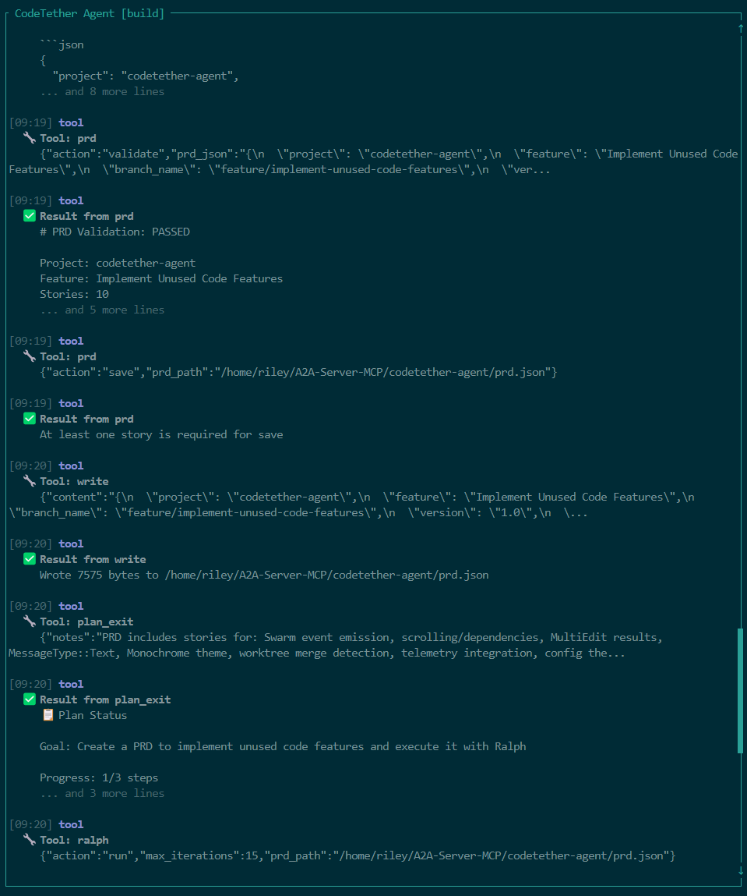

# CodeTether Agent

[](https://crates.io/crates/codetether-agent)
[](https://www.npmjs.com/package/codetether)
[](https://github.com/rileyseaburg/codetether-agent/releases)
[](https://opensource.org/licenses/MIT)

CodeTether is a Rust-native coding agent for interactive terminal work,
long-running autonomous tasks, and multi-agent coordination. It combines a
rich TUI, persistent tmux-like sessions, local and remote model providers,
swarm execution, MCP, A2A, and a scriptable plugin runtime in one binary.



## Why CodeTether

- **Persistent workspaces** — detach from shells or agent TUIs and reconnect
  later without wrapping CodeTether in tmux.
- **Long-horizon memory** — full workspace recall with bounded retained memory,
  even across thousands of sessions.
- **One agent, many surfaces** — use the TUI, one-shot CLI, MCP server, A2A
  worker, HTTP server, or autonomous loops.
- **Parallel execution** — split complex work across local tasks, Git
  worktrees, or Kubernetes pods.
- **Extensible at runtime** — add TetherScript plugins without modifying or
  rebuilding the Rust binary.
- **Security by default** — mandatory API authentication, append-only auditing,
  project trust boundaries, configurable tool policy, and Vault-first secrets.

## Quick Start

Try the TUI without installing Rust:

```bash
npx codetether
```

Or install the binary and start a session:

```bash
curl -fsSL https://raw.githubusercontent.com/rileyseaburg/codetether-agent/main/install.sh | sh
codetether auth codex
codetether
```

Run one task without opening the TUI:

```bash
codetether run "explain this codebase"
```

Run `codetether --help` or `codetether <command> --help` for the complete CLI
reference.

## Install

### Linux and macOS

```bash
curl -fsSL https://raw.githubusercontent.com/rileyseaburg/codetether-agent/main/install.sh | sh
```

Add `--functiongemma` to install the optional local tool-routing model:

```bash
curl -fsSL https://raw.githubusercontent.com/rileyseaburg/codetether-agent/main/install.sh | sh -s -- --functiongemma
```

### Windows

```powershell
irm https://raw.githubusercontent.com/rileyseaburg/codetether-agent/main/install.ps1 | iex
```

### Cargo

```bash
cargo install codetether-agent
```

Optional acceleration features are `candle-accelerate`, `candle-mkl`, and
`candle-cuda`.

### From Source

```bash
git clone https://github.com/rileyseaburg/codetether-agent.git
cd codetether-agent
cargo install --path .
```

## Persistent Mux Sessions

The network mux keeps the server, windows, working directories, and child
processes alive after the client disconnects. Each window can run a different
shell or CodeTether TUI in a different repository.

```bash
# Create and attach to a session in a project directory.
codetether mux new -s backend -c /work/backend

# Create one without attaching.
codetether mux new -s frontend -c /work/frontend -d

# List, reconnect, and stop sessions.
codetether mux list
codetether mux attach -t backend
codetether mux kill backend
codetether mux kill-all
```

At the `mux>` prompt:

- Enter `bash -l` for a full interactive shell.
- Enter `codetether tui --access-mode full` to start an agent TUI.
- Enter any other program command to run it in the active window.
- Use `new PATH`, `cd PATH`, `select ID`, and `close ID` to manage windows.
- Press `Tab` after `new` or `cd` to complete folders.
- Press `Ctrl+B`, then `D` to detach from a live program back to `mux>`.
- Enter `detach` at `mux>` to disconnect while the session keeps running.

The mux prompt is a control surface, not a shell parser. Launch `bash -l` when
you want normal shell behavior such as pipelines, aliases, and shell built-ins.

## Measured Long-Running Performance

The current implementation is tested against real session and PTY workloads,
not only synthetic unit fixtures.

| Workload | Before | After | Change |
|---|---:|---:|---:|
| Recall retained RSS across 4,844 sessions | 749,128 KiB | 27,356 KiB | 96.3% less |
| Idle mux reads in about one second | 57 | 1 | 98.2% fewer |
| Mux replay-buffer RSS delta | 10,664 KiB | 6,668 KiB | 37.5% less |
| Threads added by 24 live programs | 48 | 25 | 47.9% fewer |
| Replay-buffer throughput | 15,369 MiB/s | 20,769 MiB/s | 35.1% faster |

Recall streams every cataloged sidecar through a bounded top-K ranker instead
of retaining a decoded workspace in every TUI. The mux uses event-driven
output, shared child reaping, and a bounded 4 MiB replay buffer.

See the reproducible [recall memory benchmark](docs/benchmarks/recall-memory.md),
[mux long-horizon benchmark](docs/benchmarks/mux-long-horizon.md), and
[runtime memory controls](docs/runtime_memory.md) for methodology and
correctness coverage.

## Core Workflows

| Goal | Command |
|---|---|
| Interactive agent | `codetether` |
| One-shot task | `codetether run "task"` |
| Parallel sub-agents | `codetether swarm "complex task"` |
| PRD-driven loop | `codetether ralph run --prd prd.json` |
| OKR opportunity loop | `codetether forage --loop --execute` |
| Large-context analysis | `codetether rlm "question" -f path` |
| Local code index | `codetether index --path src --json` |
| A2A server | `codetether serve --port 4096` |
| A2A worker | `codetether worker --server URL` |
| MCP stdio server | `codetether mcp serve` |
| Available models | `codetether models` |

### Access Modes

CodeTether exposes the same access policy in the TUI and one-shot runner:

| Mode | Behavior |
|---|---|
| `ask` | Request approval for protected actions |
| `approve` | Auto-approve safe actions and ask for higher-risk operations |
| `full` | Allow full tool access without approval prompts |

```bash
codetether tui --access-mode approve
codetether run "fix the failing test" --access-mode full
```

`--yolo` also enables full access and automatic edit application. Use it only
in a workspace where that level of authority is intentional.

### TUI Essentials

Useful commands include:

| Command | Purpose |
|---|---|
| `/help` | Open the complete command and key reference |
| `/status` | Show session, model, context, and policy state |
| `/access-mode MODE` | Change the live access policy |
| `/model` | Select a provider and model |
| `/file PATH` | Attach a file to the conversation |
| `/mux` | Manage persistent sessions and workspace windows |
| `/spawn NAME` | Start a named sub-agent |
| `/agents` | Open the unified agent dashboard |
| `/swarm TASK` | Run a task with parallel sub-agents |
| `/undo [N]` | Remove recent turns from the current session |
| `/fork [N]` | Fork the session from an earlier point |
| `/audit` | Inspect the action trail |

Press `?` in the TUI for current key bindings.

## Capabilities

### Sessions and Recall

The canonical transcript stays append-only. Every provider turn receives a
fresh derived context that can compress oversized history and repair tool-call
pairs without rewriting the source session. Recall searches the canonical
history, so older details remain available even after context compression.

### Swarm, Ralph, and Forage

- **Swarm** decomposes a task and runs sub-agents concurrently using local
  tasks or isolated Kubernetes pods.
- **Ralph** executes a PRD story by story and persists progress through the PRD,
  `progress.txt`, and Git history.
- **Forage** ranks work from active OKRs and can execute selected opportunities
  in isolated worktrees.

```bash
codetether swarm "implement authentication with tests"
codetether ralph create-prd --feature "User Auth" --project-name my-app
codetether forage --top 5
```

### Recursive Language Model

RLM lets an agent explore content larger than its context window with
structured head, tail, grep, count, slice, and recursive-query operations.

```bash
codetether rlm "What are the main components?" -f src/lib.rs
cat service.log | codetether rlm "Summarize the failures" --content -
```

### TetherScript Plugins

TetherScript is the runtime extension layer. Plugins can perform filesystem,
HTTP, JSON, JavaScript, and browser operations without a Rust change or binary
rebuild.

```json
{
  "path": "examples/tetherscript/lmstudio_gemma.tether",
  "hook": "chat",
  "args": ["explain this codebase", "gemma"]
}
```

See the [plugin contract and testing guide](docs/plugin_pattern.md) for the
available built-ins and return-value conventions.

## Providers and Credentials

CodeTether supports hosted APIs, subscription OAuth, cloud platforms, and local
models. Run `codetether models` to see what is available in the current
environment.

For subscription-backed OpenAI Codex access:

```bash
codetether auth codex
```

Provider secrets are loaded from HashiCorp Vault first. Local development can
fall back to supported environment variables and local AWS credentials. Set
`CODETETHER_DISABLE_ENV_FALLBACK=1` when Vault must be the only credential
source.

```bash
export VAULT_ADDR="https://vault.example.com:8200"
export VAULT_TOKEN="hvs.your-token"
vault kv put secret/codetether/providers/openrouter api_key="..."
export CODETETHER_DISABLE_ENV_FALLBACK=1
```

Never commit credentials to `codetether.toml` or the repository.

## MCP Integration

CodeTether exposes its tool registry over MCP stdio. List the live registry
instead of relying on a static tool count:

```bash
codetether mcp list-tools
codetether mcp serve
```

Example client configuration:

```json
{
  "mcpServers": {
    "codetether": {
      "command": "/absolute/path/to/codetether",
      "args": ["mcp", "serve", "/absolute/path/to/workspace"],
      "env": { "RUST_LOG": "error" }
    }
  }
}
```

For Codex CLI, use the equivalent TOML entry:

```toml
[mcp_servers.codetether]
command = "/absolute/path/to/codetether"
args = ["mcp", "serve", "/absolute/path/to/workspace"]
```

## A2A and Agent Bus

CodeTether can serve JSON-RPC and gRPC A2A transports while coordinating local
agents through an in-process topic bus.

```bash
codetether serve --port 4096
codetether worker --server https://api.example.com --codebases /work/project
codetether spawn --name planner --peer http://localhost:4096/a2a
```

See the [A2A multi-repository walkthrough](docs/a2a-spawn.md) and
[public-agent guide](docs/a2a-public-agents.md) for discovery, agent cards, and
transport details.

## Security Model

| Control | Behavior |
|---|---|
| API authentication | Bearer authentication is mandatory except for `/health` |
| Audit trail | Actions are appended to a queryable JSON Lines log |
| Project trust | Repository policy is ignored until its canonical path is trusted |
| Tool policy | Access mode, approvals, sandboxing, and network access are explicit |
| Plugin integrity | Tool manifests support Ed25519 signatures and SHA-256 checks |
| Secrets | Vault is preferred; environment fallback can be disabled |

Inspect or change project trust with:

```bash
codetether config project status
codetether config project trust
codetether config project untrust
```

## Configuration

User configuration lives at `~/.config/codetether-agent/config.toml`.
Project-local configuration lives in `codetether.toml` and is subject to the
project trust boundary.

```toml
[default]
provider = "anthropic"
model = "claude-sonnet-4-20250514"

[ui]
theme = "marketing"

[session]
auto_save = true

[lsp.linters]
eslint = { enabled = true }
ruff = { enabled = true }
```

Important environment variables:

| Variable | Purpose |
|---|---|
| `VAULT_ADDR`, `VAULT_TOKEN` | Vault connection and authentication |
| `VAULT_MOUNT`, `VAULT_SECRETS_PATH` | Provider-secret location |
| `CODETETHER_DISABLE_ENV_FALLBACK` | Require Vault-only provider credentials |
| `CODETETHER_AUTH_TOKEN` | Override the generated API bearer token |
| `CODETETHER_DATA_DIR` | Override the runtime data directory |
| `CODETETHER_A2A_PEERS` | Seed A2A peer URLs |
| `CODETETHER_MALLOC_ARENA_MAX` | Limit glibc allocator arenas |
| `CODETETHER_MALLOC_TRIM_KIB` | Configure allocator trimming threshold |

Runtime state is stored in `.codetether-agent`; isolated worktrees are stored
in `.codetether-worktrees`. Preview cleanup before removing generated state:

```bash
codetether cleanup --dry-run
codetether cleanup --artifacts
codetether worktree cleanup --base main --root ../project-worktrees
```

## Architecture

```text
TUI / CLI / MCP / HTTP / A2A
              │
        Agent runtime
     ┌────────┼─────────┐
 Providers   Tools    Sessions
     │         │         │
   Vault    Sandbox   Recall index
              │
      Bus / Swarm / Worktrees / Kubernetes
```

The library root is [src/lib.rs](src/lib.rs). Major subsystems live under
`src/agent`, `src/provider`, `src/tool`, `src/session`, `src/tui`, `src/a2a`,
`src/swarm`, and `src/server`.

## Development

```bash
cargo test
cargo clippy --all-features
cargo fmt --check
./check_file_limits.sh
```

Before contributing, read [AGENTS.md](AGENTS.md) for code style, documentation,
testing, security, and file-size requirements.

## License

MIT
