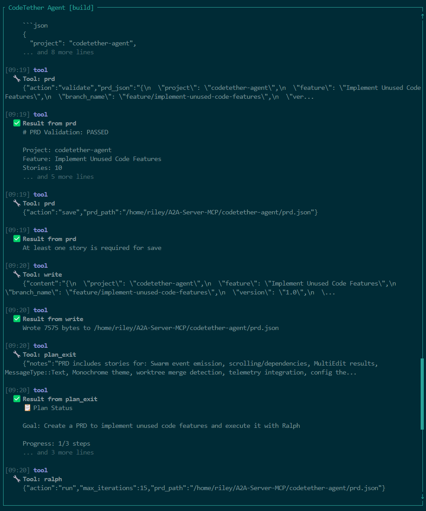

# CodeTether Agent

[](https://github.com/rileyseaburg/codetether-agent/releases)
[](https://crates.io/crates/codetether-agent)
[](https://opensource.org/licenses/MIT)

CodeTether Agent is an A2A-native AI coding agent for terminal-first software
work. It ships as one Rust binary, `codetether`, and combines an interactive
TUI, one-shot prompts, persistent mux sessions, managed Git worktrees,
provider-backed model routing, MCP, A2A workers, swarm execution, and a
TetherScript plugin runtime.



## What it is

CodeTether is built for developers who want an agent that can stay close to the
repository and keep working across longer tasks:

- **Interactive by default**: running `codetether` starts the TUI.
- **Scriptable when needed**: use `codetether run "..."` for one-shot work.
- **Session-oriented**: mux sessions let you detach, reconnect, and steer work.
- **Multi-agent capable**: swarm, Ralph, Forage, and A2A cover autonomous and
  distributed workflows.
- **Tool-aware**: native tools, browser control, Windows automation, MCP, and
  TetherScript plugins run through the same agent runtime.
- **Security-conscious**: Vault-first provider secrets, mandatory server auth,
  audit logs, policy hooks, approvals, and managed worktree isolation are part
  of the normal operating model.

## Install

The GitHub release installers are the preferred way to get the current binary.
Registry packages can lag behind release assets.

### Windows

Open PowerShell normally, not as Administrator:

```powershell
irm https://raw.githubusercontent.com/rileyseaburg/codetether-agent/main/install.ps1 | iex
codetether --version
```

If the command is not found or resolves to an old binary, use
[Windows installation and PATH checks](docs/install_windows.md). To update only
an existing Vault token, see [update Vault on Windows](docs/update_vault_windows.md).

### Linux and macOS

```sh
curl -fsSL https://raw.githubusercontent.com/rileyseaburg/codetether-agent/main/install.sh | sh
command -v codetether
codetether --version
```

If the command is not found or resolves to an old binary, use
[Unix installation and PATH checks](docs/install_unix.md).

### Cargo

```sh
cargo install codetether-agent
```

From a checkout:

```sh
git clone https://github.com/rileyseaburg/codetether-agent.git
cd codetether-agent
cargo install --path .
```

Optional features are explicit. The default feature set includes TetherScript.
Local model, QUIC, and FIPS builds opt in separately:

```sh
cargo install --path . --features candle
cargo install --path . --features candle-cuda
cargo install --path . --features quic-transport
cargo install --path . --features fips
```

FIPS builds require CMake, Go, and a C compiler. See [FIPS](docs/fips.md).

## First run

Configure credentials before asking the agent to call a model. CodeTether loads
provider secrets from HashiCorp Vault first; local environment fallbacks are for
development convenience and can be disabled.

```sh
codetether vault --help
codetether auth --help
codetether models
```

Then start the interactive UI:

```sh
codetether
# or
codetether tui
```

For a single prompt:

```sh
codetether run "inspect this repository and summarize the main entry points"
```

For hardened deployments that must use Vault only:

```sh
export CODETETHER_DISABLE_ENV_FALLBACK=1
codetether serve
```

Credential guides:

- [Vault CLI](docs/vault_cli.md)
- [Unix Vault setup](docs/install_unix_vault.md)
- [Windows Vault setup](docs/install_windows_vault.md)
- [Vault token renewal](docs/vault_token_renewal.md)

## Common commands

```sh
codetether                  # start the TUI
codetether tui              # start the TUI explicitly
codetether run "..."        # one-shot prompt
codetether models           # list configured models
codetether mux --help       # manage persistent mux sessions
codetether worktree --help  # manage Git worktrees and editor integration
codetether serve --help     # authenticated HTTP API server
codetether worker --help    # A2A worker mode
codetether mcp --help       # Model Context Protocol server/client
codetether browserctl --help
codetether windows --help
```

Autonomous and analysis commands:

```sh
codetether swarm --help     # parallel sub-agent execution
codetether ralph --help     # PRD-driven autonomous loop
codetether forage --help    # OKR-guided opportunity scanner/executor
codetether okr --help       # objectives and key results
codetether rlm --help       # recursive large-content analysis
codetether search --help    # routed grep/glob/web/memory/RLM search
codetether benchmark --help
```

Setup and operations commands:

```sh
codetether config --help
codetether auth --help
codetether vault --help
codetether approval --help
codetether connect --help
codetether pr --help
codetether cleanup --help
```

## Feature areas

### TUI and sessions

The TUI is the default front door for day-to-day work. Mux sessions make agent
and shell work durable so you can disconnect, return, and steer later.

Docs:

- [Mux agent tasks](docs/mux_agent_tasks.md)
- [Worktree lifecycle](docs/worktree_lifecycle.md)
- [Runtime memory](docs/runtime_memory.md)

### Agents, A2A, MCP, and autonomy

CodeTether can run as an interactive local agent, an A2A worker, an MCP
server/client, or an autonomous loop. Ralph works from PRDs; Forage selects work
from OKRs; Swarm splits tasks across isolated workers.

Docs:

- [A2A public agents](docs/a2a-public-agents.md)
- [A2A spawn](docs/a2a-spawn.md)
- [Collaboration tools](docs/collaboration-tools.md)
- [PRD](docs/PRD.md)

### Tools and plugins

Native tools cover files, shell commands, browser control, Windows desktop/OCR,
Git, worktrees, search, model calls, and approvals. TetherScript plugins add
repeatable tools without changing or rebuilding Rust code.

Docs:

- [Plugin pattern](docs/plugin_pattern.md)
- [Browser capability API](docs/browser-capability-api.md)
- [Windows OCR and shadow input](docs/windows_ocr_shadow_input.md)
- [Computer-use safety](docs/computer_use_safety.md)

### Local inference and specialized builds

Remote providers are the default path, but the crate also exposes opt-in local
model features through Candle and Bonsai-oriented commands.

Docs:

- [Native Bonsai](docs/native_bonsai.md)
- [FIPS](docs/fips.md)

## Security model

CodeTether assumes credentials and tool execution need explicit boundaries:

- Provider secrets are Vault-first.
- HTTP server auth is mandatory except for `/health`.
- Audit events are append-only JSON Lines records.
- Policy checks can be enforced through OPA.
- Tool execution supports approvals and runtime policy.
- Agent work is isolated with managed worktrees where appropriate.
- FIPS builds can require the AWS-LC FIPS module at startup.

Start with [Vault CLI](docs/vault_cli.md), [FIPS](docs/fips.md), and
[computer-use safety](docs/computer_use_safety.md) for operational details.

## Development

This repository is a Rust workspace. The main crate publishes the `codetether`
binary and the `codetether_agent` library. Workspace crates include A2A worker
core, browser support, and RLM support.

Useful local checks:

```sh
cargo fmt
cargo test --doc
cargo test <focused_filter> --lib
./check_file_limits.sh
```

Avoid assuming all optional features work on every workstation. CUDA, local
model, QUIC, and FIPS feature sets may require extra system toolchains.

Repository shape:

```text
src/      main application, providers, tools, TUI, sessions, server, swarm
crates/   workspace support crates
docs/     installation, security, plugin, transport, and operations guides
vendor/   vendored build dependencies used by selected workflows
```

## Documentation map

- [Unix install](docs/install_unix.md)
- [Windows install](docs/install_windows.md)
- [Vault CLI](docs/vault_cli.md)
- [Plugin pattern](docs/plugin_pattern.md)
- [A2A public agents](docs/a2a-public-agents.md)
- [Native Bonsai](docs/native_bonsai.md)
- [FIPS](docs/fips.md)
- [Worktree lifecycle](docs/worktree_lifecycle.md)
- [TUI rendering performance](docs/tui_rendering_performance.md)

## License

MIT. See the package metadata in `Cargo.toml`.